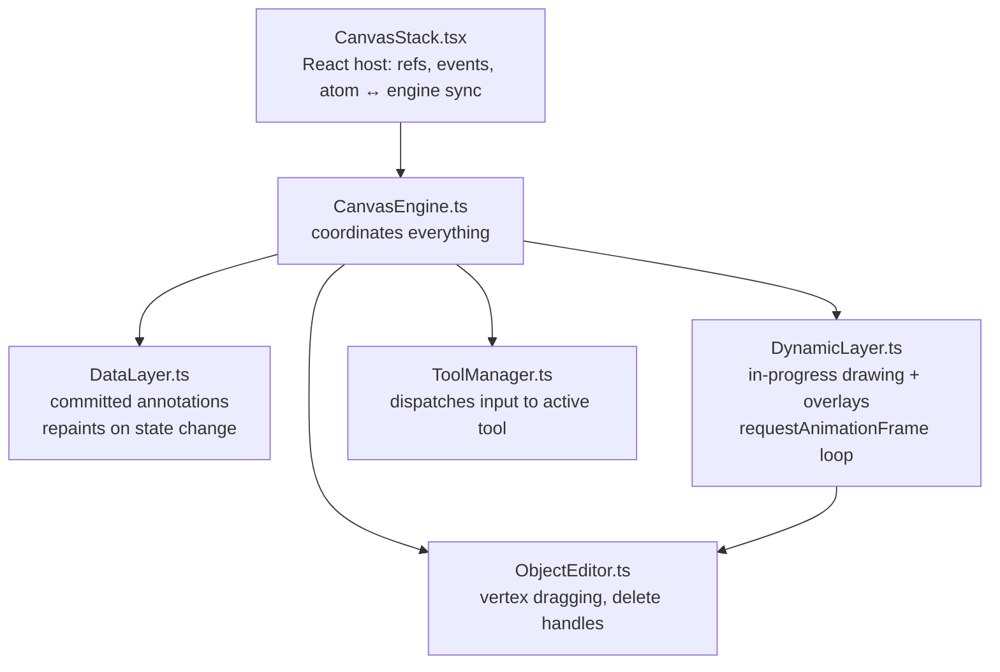
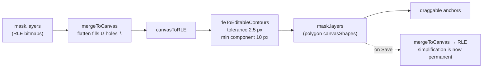
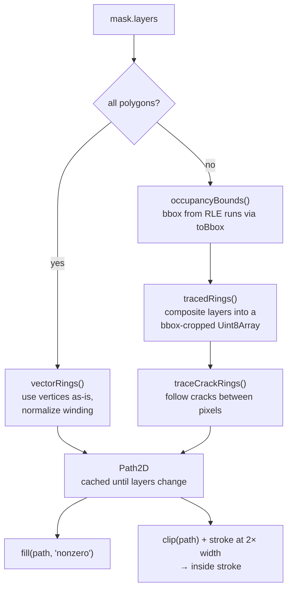

# How masks are drawn

A guide to the canvas rendering path in ThinAnnotator — what draws a mask, what draws its
border, what draws the anchors you drag — and what changed when mask borders moved from
rasterized bitmaps to vector contours.

Written for anyone touching `src/canvas/`. No prior knowledge of the codebase assumed.
See [CLAUDE.md](../CLAUDE.md) for conventions and [README.md](../README.md) for what the tool does.

For the border change specifically, [border-raster-vs-vector.html](border-raster-vs-vector.html) puts
the two approaches side by side with diagrams generated from the real code. Open it in a browser —
GitHub shows HTML as source rather than rendering it.

---

## 1. Four things are called "Mask"

This trips up everyone once. Get it straight first.

| Name | Where | What it actually is |
|---|---|---|
| `Mask` | `app/atom.ts` | **State.** One annotated mineral grain: id, label, colour, `layers[]`, mineral `annotation`. This is the document. |
| `Mask` | `canvas/annotations/Mask.ts` | **Renderer.** A class that knows how to draw the state object above. Same name, completely different thing. |
| `MaskLayer` | `app/atom.ts` | **A piece** of a grain — either an RLE bitmap (`rleMask`) or a vector `canvasShape`, tagged `layerKind: "fill" \| "hole"`. |
| `RLEMask` | `app/atom.ts` | The wire format — COCO run-length encoding, `{counts, size}`. |

A grain's final shape is **union of fills minus union of holes**. While you edit, layers pile up;
**Save** collapses them into one RLE layer via `mergeToCanvas`.

One more collision: `objectId` in engine callbacks means *mask id*. `objectId` in GraphQL is SAM 2's
own id (hardcoded to `1` for point prompts, reused as the superpixel index for SLIC). Unrelated.

---

## 2. The canvas stack

Three siblings inside the editor container, and the arrangement matters:

```
<div position:relative overflow:hidden>          ← container
     ← the photo, CSS-transformed
  <canvas dataRef  pointer-events:none>               ← committed annotations
  <canvas dynRef>                                     ← previews, handles, mouse events
```

The canvases sit **outside** the image's transform and cover the whole container. Their backing
store is `container.clientSize × devicePixelRatio`, set by a `ResizeObserver` — never resized on
zoom. The view is applied *inside* the 2D context instead:

```ts
ctx.setTransform(zoom * dpr, 0, 0, zoom * dpr, panX * dpr, panY * dpr);
```

**Why it's built this way.** An earlier design sized the canvases to the image's natural resolution
and let CSS stretch them. That meant every stroke was rasterized at image resolution and *then*
scaled — a second resample of already-rasterized output, which made every line blurry above 1×
zoom. Vector strokes are now re-rasterized per frame at screen resolution. This is the single most
important invariant in the canvas code.

### Coordinates

All geometry is stored in **image intrinsic pixels**. Mouse events convert on entry:

```ts
x = (clientX - rect.left - view.panX) / view.zoom
```

This is only correct while the ``'s CSS layout box equals its intrinsic size — hence the
explicit `width` / `height` / `maxWidth: "none"` on that element in `CanvasStack.tsx`. Tailwind's
preflight sets `max-width: 100%`, which silently breaks every coordinate in the app. **Don't remove
them.**

---

## 3. Two layers, two passes



**`DataLayer`** holds what is finished: masks and prompts. It repaints only when something changes —
`setView`, `setMasks`, `setCurrentMaskId`, `setHoveredMaskId` each call `render()`. Note that
`setView` is in that list: **every pan and zoom frame repaints every mask.** That fact drives most
of the performance reasoning later in this document.

**`DynamicLayer`** runs a continuous `requestAnimationFrame` loop and renders in two distinct passes
(`DynamicLayer.ts:77` and `:82`):

- **Document pass** — the view transform is applied, geometry is in image pixels. Sizes are CSS
  pixels, so you divide by zoom at the call site: `ctx.lineWidth = theme.bbox.lineWidth / zoom`.
- **Overlay pass** — `setTransform(dpr,0,0,dpr,0,0)`, sizes are literal CSS pixels. Handles, the
  cursor HUD, the pixel grid.

Getting the pass wrong is the classic bug here: geometry drawn in the overlay pass ignores pan and
zoom entirely and sticks to the corner of the screen.

`canvas/canvas-theme.ts` is the single source of truth for every colour, width, radius, dash and
alpha. All values are CSS pixels. No file outside it should hardcode a visual constant.

---

## 4. What actually gets drawn

Beyond masks, the canvas carries:

- **Prompts** — SAM point prompts (`Keypoint`) and box prompts (`BoundingBox`), drawn by `DataLayer`
  after the masks.
- **Tool previews** — the rubber-band box, the in-progress freeform path, the polygon being lassoed.
  These live in `DynamicLayer` and belong to whichever tool is active (`ToolManager` dispatches to
  `KeypointTool`, `BoundingBoxTool`, `SlicBboxTool`, `FreeformDrawTool`, `PolygonLassoTool`). A tool
  with no branch in `ToolManager` is inert by construction — that's how the `idle` pointer works.
- **Skeleton mode** — when the *active* mask consists only of polygon layers, `Mask.renderSkeleton`
  (`Mask.ts:250`) draws it as outlines instead of a filled shape: solid stroke for fills, dashed
  orange for holes.
- **The pixel grid** — above 12× zoom, `DynamicLayer.drawPixelGrid` (`:271`) overlays the actual
  image pixel lattice. Remember this one; it matters in §9.
- **The minimap**, and the **SLIC** and **Refine** overlays, which each render their own `` plus
  their own mask compositing, separate from this pipeline.

---

## 5. Anchors: how mask editing works

`ObjectEditor` owns direct manipulation of the active mask — dragging vertices, deleting layers.
It's wired into `DynamicLayer` and renders in both passes: the drag outline in the document pass
(`renderDoc`), the handles themselves in the overlay pass (`renderOverlay`) so they stay a constant
size on screen no matter the zoom.

Hit-testing scales correctly: `const hitR = theme.editor.hitPx / this.zoom`.

**The critical detail — anchors only exist for polygon layers.**

```ts
private getVertices(layer: MaskLayer): ImageSpacePoint[] | null {
    const temp = this.tempVertices.get(layer.id);
    if (temp) return temp;
    if (layer.canvasShape?.kind === "polygon") return layer.canvasShape.vertices;
    return null;   // ← an RLE layer has no draggable vertices, ever
}
```

An RLE bitmap has no vertices to drag. So to hand-edit a SAM-generated mask, the app must first
**convert it to polygons** — that's the "activate anchors" button in `MaskEditTools`:



That dotted arrow is worth staring at. **Activating anchors is lossy, and the loss is written to
disk.** At the default 2.5 px tolerance, single-pixel boundary detail is gone; components under 10
pixels are dropped entirely; rings that simplify below 3 vertices vanish, so small holes can
disappear. Whether that matters is a domain question, but it should be a *decision*, not a surprise.

It isn't simply a bug to fix by lowering the tolerance, either: anchor mode exists so a human can
drag a manageable number of handles. An exact contour of a grain has hundreds of vertices, which
would make the feature unusable. Fixing it properly means a different design — keeping the RLE as
the source of truth and treating anchors as a deformation, or restricting anchor mode to masks that
are already polygonal. It's an open problem, listed in §14.

Each layer also gets a delete handle. For polygons it sits just off the layer's top-right corner;
for RLE layers `delPos` returns `{x: maskW - inset, y: inset}` — and `maskW` is the width of the
*whole image*, so the handle floats at the top-right of the image rather than near the grain. Known
quirk.

---

## 6. How a mask used to be drawn

Before the change described in §7, `Mask.renderWithNatural` did this:

1. **Composite** every layer into one full-image canvas — fills with `source-over`, holes with
   `destination-out`. RLE layers were first turned into a white-on-transparent alpha canvas, one per
   layer, cached.
2. **Find the border** with a per-pixel morphological pass. Read the composite back with
   `getImageData`, then for every pixel:

```ts
if (!occupied(x, y)) continue;              // only mask pixels can ever be border

let isBorder = false;
outer: for (let dx = -bt; dx <= bt; dx++) {
    for (let dy = -bt; dy <= bt; dy++) {
        const nx = x + dx, ny = y + dy;
        if (nx < 0 || nx >= natW || ny < 0 || ny >= natH) { isBorder = true; break outer; }
        if (!occupied(nx, ny)) { isBorder = true; break outer; }
    }
}
```

3. **Colour it** — border pixels opaque, interior pixels at `fillAlpha`, and in `borderOnly` mode
   skip the interior. Write the result into a second full-image canvas and cache it.
4. **Blit** that canvas through the view transform with `imageSmoothingEnabled = false`. Hover was a
   second additive blit of the same bitmap; the active mask got a `drop-shadow` CSS filter.

Two properties of this design matter:

**The border was strictly *inside* the mask.** That `continue` on the third line means a pixel that
isn't part of the mask is skipped before anything is written. Only mask pixels were ever painted, so
the mask's painted extent equalled its true extent. The border ate up to 2 pixels *into* the fill
rather than extending past it.

```
        outside          inside
   ..........|=====|##########      | = border band (2px, inward)
             ^                      # = translucent fill
             true boundary          . = nothing painted
```

**The border thickness was measured in image pixels.** `theme.mask.borderThickness = 2` was a kernel
radius on the natural-resolution pixel grid — not a stroke width. The theme file had to carry an
explicit "UNITS EXCEPTION" comment because of it.

### What that cost

| | Value on a 4000×3000 plate |
|---|---|
| Border pass | `w × h × (2·bt+1)²` ≈ **300M neighbour checks** per mask, per content change |
| Cached canvases | one alpha canvas per layer **+** one composite, ≈ **96 MB per mask** |
| 50 masks | multiple gigabytes of canvas backing store |

---

## 7. What changed

Masks now render the way `Polygon` always has: **a cached `Path2D`, filled and stroked at
`lineWidth / zoom`.**



### The tracer

`traceCrackRings` (`polygonUtils.ts:81`) is the heart of it. The existing `traceBoundary`
(`polygonUtils.ts:10`) walks pixel **centres**; the new one follows the cracks **between** pixels
and emits pixel-**corner** coordinates.

```
   pixel centres (traceBoundary)      pixel cracks (traceCrackRings)

   ┌───┬───┬───┐                      ┏━━━┳━━━┱───┐
   │ ● │ ● │   │                      ┃███┃███┃   │
   ├─╱─┼─╲─┼───┤                      ┡━━━╃───╄━━━┩   ━ = emitted ring
   │●  │   │   │                      │███│   │   │   █ = "in" pixel
   └───┴───┴───┘                      └───┴───┴───┘

   fill covers LESS than the          fill covers EXACTLY the
   pixels — off by half a pixel       pixel set — lossless
   inward, systematically
```

That half-pixel is invisible at fit-zoom and obvious at 8×, which is why the display path needed its
own tracer rather than reusing the existing one. `traceBoundary` also terminates on "returned to the
start pixel", which can close early on a shape with a one-pixel neck; crack-following has no such
failure mode.

Three more properties:

- **Vertices are emitted only where the boundary turns**, so collinear runs collapse *losslessly*.
  A straight 50-pixel edge costs two vertices, not fifty-one. This is what keeps the vertex count
  low without any simplification.
- **All rings come out in one pass** — outer boundaries and hole boundaries alike, wound in opposite
  directions. No connected-component labelling, no separate hole flood-fill, no classification step.
- **Diagonally touching pixels are treated as connected** (8-connected foreground, 4-connected
  background), matching what `contourExtract.ts` and OpenCV do. The tracer prefers the left turn at
  a saddle, which is what fuses the diagonal.

### Winding, not even-odd

Rings are filled with the **nonzero** rule, not even-odd. Both give identical results for rings
traced from a binary grid, but they differ for the all-polygon path: two *overlapping* fill polygons
must union, and even-odd would XOR them, punching a hole where they overlap. `vectorRings` normalizes
each polygon's winding by signed area — fills positive, holes negative — so nonzero unions fills and
subtracts holes, exactly reproducing the old `source-over` / `destination-out` behaviour.

### The stroke goes inside

Since the old border was strictly inside (§6), a plain centred `stroke()` would have put half its
width outside the mask for the first time. At 0.25× zoom half of a 2.5 CSS-px stroke is **5 image
pixels** of inflation — enough to make neighbouring grains look like they overlap. So:

```ts
ctx.clip(path, "nonzero");
ctx.lineWidth = (2 * (theme.mask.strokeWidth + extra)) / zoom;
ctx.stroke(path);
```

Clip first, stroke at double width, keep only the inner half.

### Cropping

`occupancyBounds` gets each RLE layer's bounding box from `toBbox`, which walks the run-lengths
rather than the pixels. The occupancy grid is then allocated at bbox size, not image size — a grain
occupies a small fraction of a plate, so both the allocation and the trace scale with the grain
rather than the image.

---

## 8. Why — the argument in one paragraph

A thickness measured in image pixels **cannot be correct at two zoom levels at once**. At 8× zoom,
2 image pixels became a ~16 screen-pixel blocky band, wider than the detail it was covering. At
fit-zoom on a large plate (~0.3×) the same 2 pixels became 0.6 screen pixels and dropped out under
nearest-neighbour sampling, shimmering as you panned. `borderOnly` mode was worst affected, since
the border is all there is to see. There is no value of `borderThickness` that fixes this, because
the unit itself is wrong. `Polygon` never had the problem because it divides by zoom at draw time.

---

## 9. What it affects

### Good

- **Borders are a constant thickness at every zoom**, identical to polygon outlines — same code
  path, same theme constant.
- **The 300M-op border pass is gone.** Mask editing got faster, not slower.
- **~96 MB of canvas per mask became ~7.5 KB of vertices.** On a 12 MP plate with 50 grains this is
  the difference between gigabytes and megabytes.
- **Small grains keep their fill.** The old border consumed 2 pixels of fill on every edge; on a
  20-pixel grain that was most of the object rendered as opaque border.
- **Antialiased edges.** The old blit used `imageSmoothingEnabled = false`; at low zoom, thin
  structures point-sampled in and out and shimmered while panning. A vector fill antialiases, so a
  sub-pixel feature renders faint but *present*.
- **Toggling `borderOnly` no longer rebuilds geometry** — the contour cache key no longer includes
  it, so it's now just a repaint.
- **Topology is more robust.** Tracing the composited grid rather than compositing layer bitmaps
  handles awkward cases correctly — a hole layer straddling the fill edge, two fill layers touching
  at a corner.
- **The theme lost its units exception.** Every constant in `canvas-theme.ts` is now CSS pixels.

### Bad, or at least different

- **The pixel staircase is now visible at high zoom.** A pixel-exact thin outline shows every step,
  because that is genuinely what the mask is. The old fat band was wider than the steps and hid
  them. This is correct behaviour and it is still a visible change — expect people to notice.
  Mitigating context: the app already draws the actual pixel lattice above 12× zoom
  (`DynamicLayer.drawPixelGrid`), so the outline now agrees with a grid the annotator can already
  see. The old border did not.
- **Hover changed character.** It was an additive re-blit glow (`hoverGlowAlpha`); it's now a wider,
  brighter stroke, consistent with how `Polygon` handles hover. `hoverGlowAlpha` was removed.
- **The active mask's drop-shadow renders twice** — once on the fill, once on the stroke — where it
  previously applied to a single blit. The glow is slightly stronger. Arguably desirable for
  emphasis; easy to change.
- **Per-frame cost moved from blitting to stroking.** `DataLayer.setView` repaints every mask, so
  panning now strokes paths instead of blitting cached bitmaps.

### Unaffected

- **Persistence.** `mergeToCanvas` flattens layers to RLE through its own code path and never calls
  into rendering. No DTO change, no `TASK_FORMAT_VERSION` bump, existing saved tasks load unchanged.
  Any downstream statistics — modal mineral percentages, grain size — come from the saved RLE.
- **`Mask.hitTest`** reads the decoded RLE directly, not the contour. Selection behaviour is
  identical.
- **`contourExtract.ts` and `rleToEditableContours`** — untouched. Anchor mode behaves exactly as
  before, for better and worse (§5).
- **Skeleton mode, tools, prompts, the minimap, SLIC and Refine overlays** — untouched.

---

## 10. Fidelity: the part that matters for an annotation tool

The rendered mask matches the stored mask **exactly**. No simplification tolerance, no minimum
feature size, no smoothing. Concretely:

- Contour extraction at pixel-corner resolution is **lossless** — the filled ring's interior is
  precisely the set of "in" pixels.
- Collinear collapse is also lossless: removing a point that lies exactly on the line between its
  neighbours changes nothing.
- No island or hole is ever dropped for being small.
- Fill and outline come from the same path, so they cannot disagree.

This was verified rather than assumed. Traced rings were rasterized back and compared against the
input grid across handmade edge cases — single pixel, holes, islands inside holes, diagonal pinches,
one-pixel necks, blobs touching every image edge, full-image fills — and across randomised fuzz
grids, under both fill rules. Then full masks built from real RLE layers through the actual codec
were checked the same way. Zero differing pixels throughout.

**Why the strictness.** Simplification and smoothing are different knobs, and it's worth not
confusing them. Raising a Douglas–Peucker tolerance to make a boundary look smoother works by
*deleting features* — at ε ≥ 1 px, a single-pixel inclusion tip or vein terminus is erased. If a
smoother look is ever wanted, the right tool is corner-cutting (Chaikin), which displaces points by
a bounded sub-pixel amount and removes nothing. Douglas–Peucker also cuts corners inward, giving it
a *systematic* area bias rather than a random one.

---

## 11. Measured cost

50 grains on a 4000×3000 plate:

| | Before | After |
|---|---|---|
| Geometry per mask | — | ~480 vertices (~7.5 KB) |
| Stroked per frame | 50 bitmap blits | ~24,000 vertices |
| Border pass | ~300M neighbour checks / mask | gone |
| Canvas memory | ~96 MB / mask | none |
| Contour build | — | ~35 ms / mask |

On the build cost: **24 ms of that 35 ms is the RLE `decode`**, which already happened before this
change — `hitTest` needs it and the old composite path called it too. The genuinely new work is
~11 ms per mask, and it replaces a 300M-operation pass. It is cached per mask and only recomputed
when the mask's content signature changes (`DataLayer.maskSig`).

---

## 12. Considerations and probable problems

Things to watch, roughly in order of likelihood:

1. **Pan framerate with many masks.** This is the one place the change can regress. If a fully
   annotated task doesn't pan smoothly, walk this ladder in order — and note that fidelity is *not*
   on it, so don't buy framerate with tolerance:
   1. Confirm collinear collapse is running; it's the biggest reduction and it's free.
   2. Confirm `Path2D` is cached and never rebuilt during a pan.
   3. Drop the drop-shadow filter on non-active masks.
   4. Pure pan changes only `panX`/`panY`, not the rasterized content — re-stroke only on zoom or
      content change, and blit the cached raster at an offset while panning.
   5. Last resort: vector for active/hovered masks, bitmap for idle ones, accepting the
      inconsistency.
2. **Task-load hitch.** ~35 ms per mask on first render is ~1.8 s for 50 masks. Better than what it
   replaced, but if it becomes a problem the fix is decoding only the bbox region instead of the
   full grid — which means walking the RLE runs directly, and `src/jscocotools/mask.ts` is
   off-limits, so it needs a careful approach.
3. **Saddle points.** The tracer treats corner-touching pixels as connected. The old bitmap
   renderer had no connectivity notion at all — it just filled pixels. Two blobs joined at a single
   diagonal corner now render as one shape. This is a genuinely new decision, applied consistently,
   but it *is* new.
4. **Self-touching rings.** A diagonal pinch produces a ring that visits the same corner twice — a
   bowtie. It fills correctly under both fill rules (verified), but it's an unusual shape to hand to
   a geometry routine, so keep it in mind if contours are ever reused for anything beyond drawing.
5. **Degenerate polygon layers.** `vectorRings` bails to tracing if any layer has an RLE, and
   returns null if there are only holes — a lone hole would wind to nonzero and fill, where the old
   `destination-out` drew nothing.
6. **Non-matching layer and image sizes.** If an RLE layer's `size` differs from the natural image
   size, `tracedRings` nearest-neighbour maps the coordinates, preserving the old implicit resize.
   In practice they always match; the path exists so a mismatch degrades rather than corrupts.

---

## 13. Verifying a change here

1. `yarn build` — the real gate. The codebase leans on exhaustive `Record<Tool, …>` types, so a
   missed registration is a compile error rather than a runtime surprise.
2. Load a task with masks that have holes. At 1×, 8× and fit-zoom: border thickness should look
   identical at all three, holes should still be cut out, no mask should inflate or shrink.
3. `borderOnly` mode at fit-zoom — outlines should be clearly visible.
4. Pan and zoom continuously with a fully annotated task open, and profile it.
5. Save, reload, confirm the mask round-trips unchanged.
6. **Exactness check.** Rasterize the traced path at 1:1 and XOR against `mergeToCanvas` output for
   the same mask. Zero differing pixels, or it isn't faithful. This is what turns "the mask is
   accurate" from an impression into a fact, and it's cheap to re-run.

---

## 14. Open follow-ups

- **Anchor mode is lossy** (§5). The 2.5 px tolerance and 10 px minimum component size are baked
  into saved data whenever someone uses it. Needs a design, not a constant change.
- **RLE delete handles** sit at the top-right of the *image*, not the grain (§5).
- **`hitTest` thresholds** in `Polygon`, `FreeformPath` and `Keypoint` use raw image-pixel distances
  instead of `pixels / zoom`. `ObjectEditor` does it correctly. No impact today because only
  `Mask.hitTest` is called from outside.
- **`Date.now()` ids** for masks and layers can collide within a millisecond; `crypto.randomUUID()`
  is the fix. Saved documents are protected by the DTO boundary — read the old numeric ids in
  `task/mappers.ts` and bump the format version.
- **`BorderOnlyToggle.tsx`** has no importers; the toolbar button replaced it.
- **`editorOnAtom`** is written by two components and read by none.

---

## Map of the files

| File | Role |
|---|---|
| `canvas/CanvasStack.tsx` | React host — refs, event forwarding, atom ↔ engine sync |
| `canvas/CanvasEngine.ts` | Coordinates the layers, owns the view, converts coordinates |
| `canvas/layers/DataLayer.ts` | Committed masks and prompts; repaints on state change |
| `canvas/layers/DynamicLayer.ts` | rAF loop, tool previews, overlays, two-pass render |
| `canvas/ToolManager.ts` | Dispatches pointer input to the active tool |
| `canvas/ObjectEditor.ts` | Vertex dragging and per-layer delete handles |
| `canvas/annotations/Mask.ts` | Renders one mask — contour build, fill, inside stroke |
| `canvas/annotations/Polygon.ts` | The reference implementation for constant-width strokes |
| `canvas/utils/polygonUtils.ts` | `traceCrackRings` (display), `traceBoundary` + `douglasPeucker` (editing) |
| `canvas/utils/contourExtract.ts` | `rleToEditableContours` — anchor-mode conversion only |
| `canvas/utils/maskMerge.ts` | `mergeToCanvas` / `canvasToRLE` — the persistence path |
| `canvas/canvas-theme.ts` | Every visual constant, all in CSS pixels |
| `jscocotools/mask.ts` | The RLE codec. Do not touch. |
